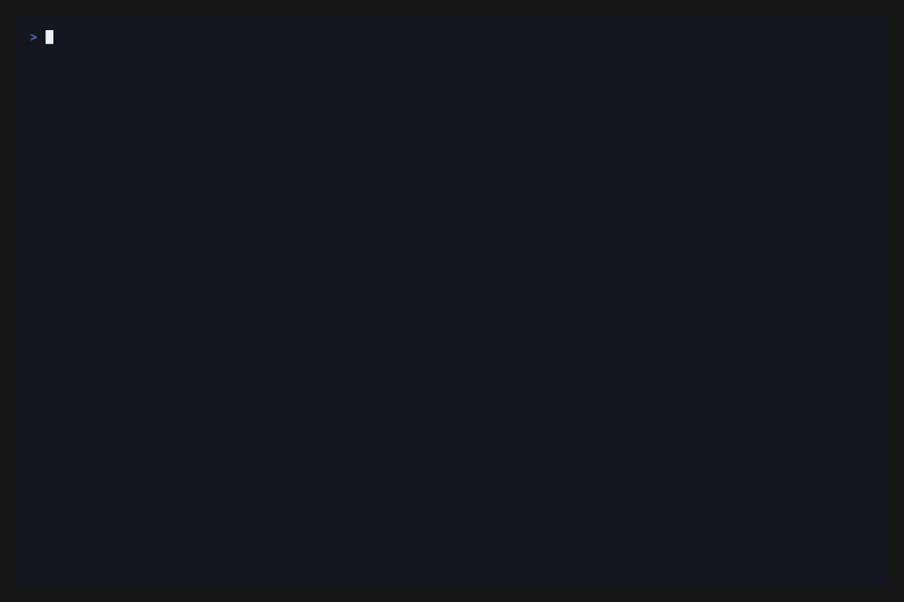

<div align="center">
<pre>
███████╗ ██████╗       ██████╗  ██████╗ ████████╗
██╔════╝██╔════╝       ██╔══██╗██╔═══██╗╚══██╔══╝
███████╗██║      █████╗██████╔╝██║   ██║   ██║   
╚════██║██║      ╚════╝██╔══██╗██║   ██║   ██║   
███████║╚██████╗       ██████╔╝╚██████╔╝   ██║   
╚══════╝ ╚═════╝       ╚═════╝  ╚═════╝    ╚═╝   
</pre>
</div>

**sc-bot** is a terminal-based conversational interface for single-cell biology. It helps you identify cell types from marker genes, retrieve markers for known populations, resolve paper-style aliases, and work against a local multi-source marker database from the command line.


- Infer likely cell types from marker gene panels
- Query markers for known cell states and tissues
- Resolve gene aliases like `CD16` and `CD161`
- Extend the local database with your own marker CSV

---

## Installation

sc-bot requires `uv` for Python package management and a Google Gemini API key.

### 1. Install `uv`
To install on macOS via Homebrew:
```bash
brew install uv
```
*(Alternatively, use curl: `curl -LsSf https://astral.sh/uv/install.sh | sh`)*

### 2. Clone and Setup
Clone the repository and install dependencies:
```bash
git clone https://github.com/nml-el/sc-bot.git
cd sc-bot
uv sync
```

### 3. Initialize the Database
sc-bot relies on PanglaoDB, CellMarker 2.0, and the Uberon ontology. 
You do not need to download these files manually. Build the local SQLite database using the orchestrator script, which will automatically download all necessary data sources, parse them, and map tissues and cell types to the ontology.

```bash
uv run python scripts/setup_db.py
```

*Note: You can ingest specific databases using flags like `--panglao` or `--cellmarker2`, or preserve the schema while refreshing data with `--keep-schema`.*

### 4. Configure API Key
sc-bot requires a Google Gemini API key. Generate a key from Google AI Studio.
Create a `.env` file in the project directory:
```bash
echo "GOOGLE_API_KEY=" > .env
```
*Open the `.env` file in a text editor (e.g., nano, vim, or VS Code) and append your API key after the equals sign.*

### 5. Run sc-bot
Launch the interactive terminal UI:
```bash
uv run sc-bot
```

---

## Feature Showcase

Explore core sc-bot workflows through short GIF walkthroughs.

### Reverse Cell Typing From a Gene List

This workflow starts from a marker panel and infers the most likely cell identity.



### Resolve Gene Aliases Used in Papers

This workflow translates paper-style names like `CD16` and `CD161` into the internal canonical symbols used by the database.


---

## Contributing

### Add your own marker CSV

You can extend sc-bot with your own marker table by placing a CSV file at `~/.sc-bot/marker_data.csv` (see `marker_data.sample.csv` in the repo). If that file exists, sc-bot will automatically refresh it on launch as long as the main database has already been initialized.

Required columns:
- `species` (`Human` or `Mouse`)
- `cell_type`
- `tissue`
- `marker_gene`

Optional columns:
- `gene_aliases` - pipe-delimited aliases like `CD161|NKR-P1A`
- `source` - source label for the row; defaults to `custom-source`

Example:

```csv
species,cell_type,tissue,marker_gene,gene_aliases
Human,Natural killer cell,Blood,KLRB1,CD161|NKR-P1A
Human,B cell,Blood,MS4A1,CD20
Mouse,Natural killer cell,Spleen,Klrb1c,CD161
```

Your personal markers are prioritized during ranking, so user-supplied evidence is surfaced before equally supported public markers.

---

## Features

*   **Multi-Source Marker Querying:** Retrieve canonical and supportive marker genes for specific cell types from multiple integrated databases (PanglaoDB + CellMarker 2.0).
*   **Reverse Cell Type Identification:** Infer likely cell identities from a list of genes using local marker lookups and enrichment analysis.
*   **Gene Alias Resolution:** Translate common paper aliases to canonical symbols and account for them in queries.
*   **Tissue-Aware Filtering:** Filter marker genes based on specific tissue constraints (e.g., Lungs vs. Kidneys). Queries map automatically between diverse source nomenclatures (e.g., "Lung" -> "Lungs") and canonical tissue lists.
*   **Consensus Scoring:** Rank markers by counting their occurrence across multiple tissues (`tissue_count`) and disparate data sources (`source_count`), separating robust core primary markers from secondary context-specific ones.
*   **Ontology Resolution:** Automatically resolve synonyms and trace lineage within the cell ontology network.
*   **Clipboard Integration:** Built-in UI actions to copy structured marker data to the system clipboard.
*   **Terminal UI:** Text-based interface compatible with standard terminal emulators.

---

## Data Sources

*   **PanglaoDB:** Marker genes and conservative tissue categories.
*   **CellMarker 2.0:** Additional marker coverage with more granular tissue labels mapped into the internal tissue system.
*   **Uberon / ontology graph:** Used to normalize and resolve cell type names, synonyms, and lineage relationships.

All data is stored locally in `~/.sc-bot/sc_markers.db` after setup.

---

## Architecture & Development

*   **Orchestration:** LangChain, LangGraph, and Google GenAI (Gemini).
*   **Interface:** Textual.
*   **Offline Data:** Local SQLite database (`~/.sc-bot/sc_markers.db`) mapped by Python scripts from PanglaoDB and CellMarker 2.0.

### Development Commands
*   Lint and auto-fix: `uv run ruff check --fix .`
*   Run tests: `uv run pytest`
*   Format code: `uv run ruff format .`
*   Lint code: `uv run ruff check .`
